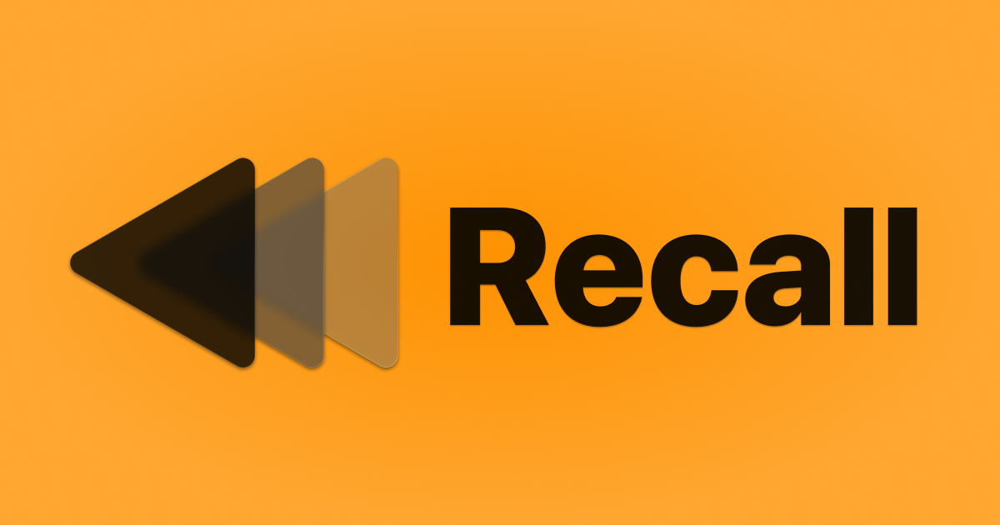
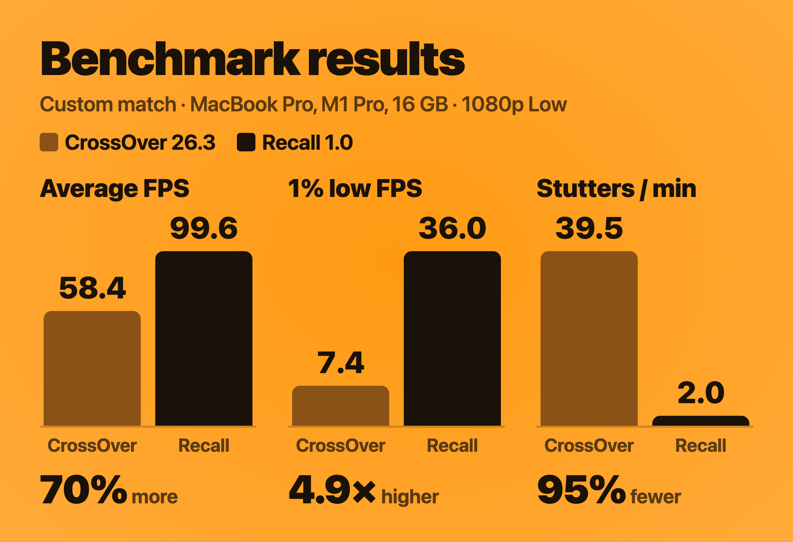

<h1 align="center">
  
</h1>

<h3 align="center">Play Overwatch on your Mac.</h3>

Recall is a free, open-source app for playing Overwatch on Apple Silicon.

  

M1 or newer · macOS 26.5 or later · Notarized by Apple

Made by Josh · <a href="#why-i-built-recall">Support the project</a>

<table align="center">
  <tr>
    <td align="center" width="50%"><h2>+70%</h2>average FPS</td>
    <td align="center" width="50%"><h2>5×</h2>higher 1% lows</td>
  </tr>
  <tr>
    <td align="center"><h2>95%</h2>fewer stutters</td>
    <td align="center"><h2>Up to 16×</h2>more mouse updates</td>
  </tr>
</table>

Compared with CrossOver on the same 14-inch MacBook Pro (M1 Pro, 16 GB), in the same custom match. Mouse: up to 2,000 updates a second in Recall, 120 in CrossOver.

https://github.com/user-attachments/assets/c0f5cac1-67fb-4b75-8bf9-06ccf402ae42

<i>CrossOver 26.3 and Recall, with live FPS from Apple's Metal Performance HUD. Custom game 929PJ, created by <a href="https://www.reddit.com/r/linux_gaming/comments/1u4oanq/auto_precompile_shaders_for_overwatch_for_peak/">u/Working_Dealer_5102</a>.</i>

Recall offers the most optimized and seamless Overwatch experience on Apple Silicon. It sets everything up for you, so you sign in to Battle.net, install Overwatch and press Play, the same as on a PC. The game runs locally on your Mac, with no Windows installation, CrossOver license or Terminal commands.

## Why Recall

- **Smoother matches.** In the same match on the same Mac, Recall averaged 70% more frames per second than CrossOver, with 1% lows nearly five times higher and 95% fewer stutters.
- **More FPS with MetalFX upscaling.** Overwatch draws fewer pixels and Apple's MetalFX rebuilds the full-resolution picture: up to 77% more frames per second at 1440p on the High preset. [How it works](docs/METALFX.md).
- **Aim that keeps up.** Recall reads your mouse directly, up to 2,000 times a second. Your flicks and tracking reach the game sooner and land exactly where your hand put them.
- **Free.** No price, trial, subscription, ads or account. The code is open source.
- **Download, sign in, play.** Recall installs what it needs and opens Battle.net for you. Play on your MacBook's screen or an external monitor, ultrawide and 5K included.

## Recall vs. CrossOver

CrossOver is the most popular way to play Windows games on a Mac, so it's the comparison that matters. I played the same scenes in CrossOver 26.3 and in Recall on my 14-inch MacBook Pro (M1 Pro, 16 GB), with the same game settings, and recorded every frame each app put on screen.

  

| | CrossOver | Recall | Difference |
|---|---:|---:|---:|
| **Custom match** | | | |
| Average FPS | 58.4 | **99.6** | +70% |
| 1% low FPS | 7.4 | **36.0** | 4.9× higher |
| Stutters per minute | 39.5 | **2.0** | 95% fewer |
| **Practice Range** | | | |
| Average FPS | 84.0 | **120.7** | +44% |
| 1% low FPS | 26.2 | **55.2** | 2.1× higher |
| Stutters per minute | 4.2 | **0.5** | 88% fewer |

1% low FPS is the frame rate during the slowest 1% of frames: the dips you feel in a fight. A stutter is a frame that took longer than 50 ms. Both apps ran Overwatch fullscreen at 1920 × 1080 on the Low preset, with V-Sync off and Dynamic Render Scale off, on macOS 26.6.2; CrossOver used its default graphics setting, D3DMetal. Each run measured about two minutes of gameplay, with loading screens and menus removed. The full results and method are in the [performance notes](docs/PERFORMANCE.md).

Curious how Recall gets these results? See [how Recall runs faster](docs/HOW-IT-WORKS.md).

**Your aim.** Overwatch is decided by flicks and tracking, so how the mouse reaches the game matters as much as frame rate. CrossOver waits for macOS to update the pointer, 120 times a second, and drops a little of your movement each time the game snaps its hidden cursor back to the center. Recall reads the mouse directly, up to 2,000 times a second, the way native Mac games do, so none of your movement is lost and it reaches the game with less delay. [How each one handles the mouse](docs/PERFORMANCE.md#mouse-input).

**Price.** CrossOver costs $74 with a year of updates, or $494 for life. Recall is free.

CrossOver is the right tool if you play many Windows games. If Overwatch is your game, Recall is built for it.

Prices as listed by CodeWeavers in October 2026.

## Get started

1. **[Download Recall](https://github.com/AsherJN/recall/releases/latest)**, open the disk image and drag Recall to Applications.
2. **Open Recall** and follow the setup steps. It prepares everything and opens Battle.net.
3. **Sign in to Battle.net**, install Overwatch and press Play.

| You need | |
|---|---|
| Mac | Apple Silicon: M1 or newer. Intel Macs aren't supported. |
| macOS | macOS Tahoe 26.5 or later |
| Memory | 16 GB recommended |
| Storage | 85–95 GB free, on your Mac or an external SSD |
| Also | A free Blizzard account, an internet connection, and Rosetta (Recall checks for it during setup) |

The [installation guide](docs/INSTALLATION.md) has more detail, including installing the game on an external drive.

## Why I built Recall

I'm Josh, a UCSB Master of Technology Management graduate who loves building tech products. I've been part of the PC Overwatch community for more than four years, and I've always wanted to take the game with me on my MacBook when I travel.

Mac gaming has had a rough reputation for a long time, and for years it was deserved. Apple Silicon changed that. These Macs are remarkably powerful, Apple is finally investing in games, and I'd love to see more developers build for the people already using them. Overwatch is the one I most want to see.

I built Recall to make playing it on a Mac easier while we wait. My hope is that Blizzard eventually brings Overwatch to the Mac natively, and that projects like this help show the interest is there. In the meantime, I hope you enjoy :)

Josh

If you'd like to support my work, you can try Mosaic News, my free news app designed to be the most transparent, customizable, and privacy focused way to follow the news.

You can also support me by helping fuel my caffeine addiction and/or starring this repository which helps other Mac players find Recall.

  
  
  

## Questions

<b>Is it really free?</b>

Yes. There's no price, trial, subscription, ad or Recall account, and the code is open source. Overwatch is free to play, so a Blizzard account is all you need. If Recall saves you the cost of other software and you'd like to say thanks, you can [buy me a coffee](https://ko-fi.com/asherjn) or try [Mosaic News](https://mosaicnews.app/?utm_source=recall&utm_medium=github&utm_campaign=readme) :)

<b>Do I need CrossOver, Windows or Boot Camp?</b>

No. Recall includes everything it needs to run Overwatch on your Mac. You don't need to buy CrossOver or install Windows, and Boot Camp doesn't exist on Apple Silicon Macs.

<b>Is it safe for my Blizzard account?</b>

You sign in to Battle.net itself, and Recall never asks for your password. Recall doesn't modify Overwatch's game files, inject code into the game or read its memory. It runs the same Windows game Battle.net installs, through Wine, the technology CrossOver is built on. Blizzard doesn't officially support playing Overwatch on a Mac, with Recall or with anything else.

<b>Why do my first matches stutter a little?</b>

The first time you play, the game prepares its shaders, the small programs your Mac's graphics chip uses to draw each scene. This causes brief stutters in your first few matches and settles down the more you play.

To get ahead of it, play Workshop code **929PJ** from Custom Games before you queue and let it run for 5 to 10 minutes.

<b>Can I use an external monitor?</b>

Yes. Set it as your main display in macOS System Settings, then choose its resolution in Overwatch's Video settings; Recall keeps it. See the [display setup instructions](docs/SUPPORT.md#id-external-monitor).

<b>Can I install the game on an external drive?</b>

Yes. Choose an external SSD during setup and keep it connected while you play. The [installation guide](docs/INSTALLATION.md) covers supported formats and setup.

<b>What happens when Overwatch or macOS updates?</b>

Overwatch updates through Battle.net, as usual. If a Blizzard or macOS update needs a fix on the Mac side, it arrives as a Recall update. Recall checks for new versions when it opens and lets you choose when to install them. The shaders Recall has learned carry over through updates, so you don't start from scratch.

<b>How do I uninstall it?</b>

Choose Settings › Uninstall Recall. It moves Recall and the game installation it manages to the Trash. Your Blizzard account is unaffected. See [uninstalling](docs/SUPPORT.md#uninstalling) for details.

## Help and contributions

[Report a bug](https://github.com/AsherJN/recall/issues/new?template=bug_report.yml) · [Share how it runs on your Mac](https://github.com/AsherJN/recall/issues/new?template=performance_report.yml) · [Suggest an idea](https://github.com/AsherJN/recall/issues/new?template=feature_request.yml)

For troubleshooting and privacy information, see [Support and privacy](docs/SUPPORT.md). Remove account names and personal file paths before sharing a report.

Interested in the code? Start with the [architecture](docs/DEVELOPMENT.md) and [build instructions](docs/BUILDING.md).

Recall uses Wine from CodeWeavers' published CrossOver sources, DXMT by Feifan He through NerRobDog's fork, and Soju's runtime build recipe. Recall's original code is licensed under [Apache 2.0](LICENSE); dependencies and patches keep their own licenses. See the [third-party notices](THIRD_PARTY_NOTICES.md).

Recall is an independent community project, not affiliated with or endorsed by Blizzard Entertainment, Apple or CodeWeavers. Overwatch, Mac, CrossOver and other product names are trademarks of their respective owners.
