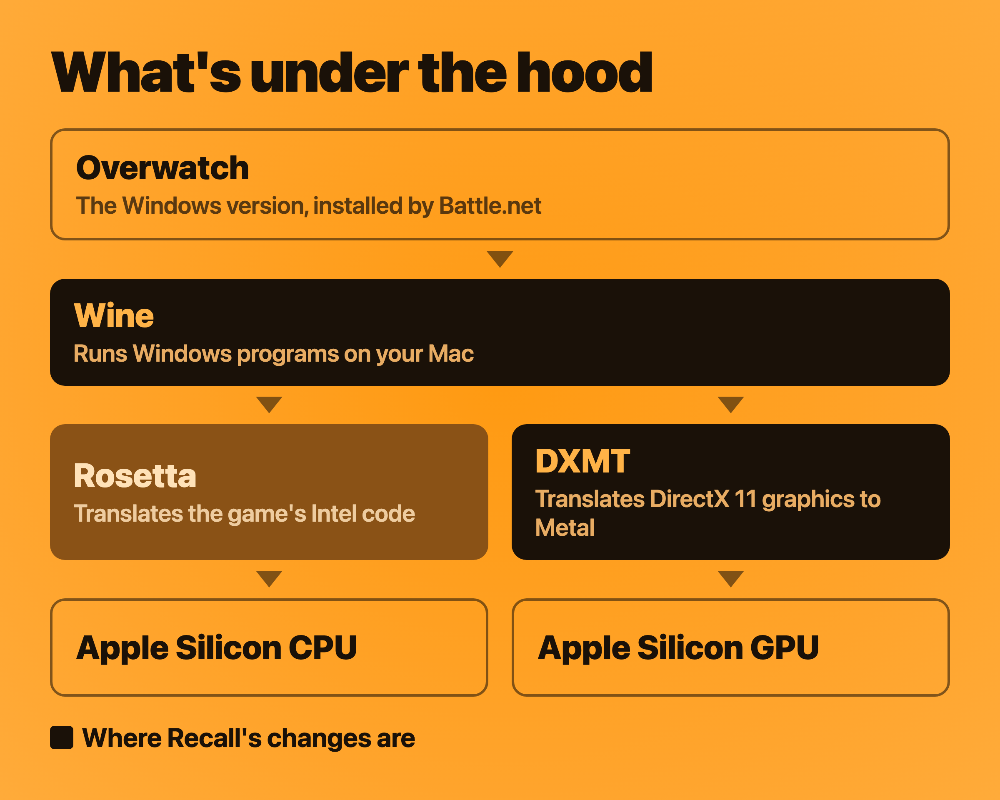
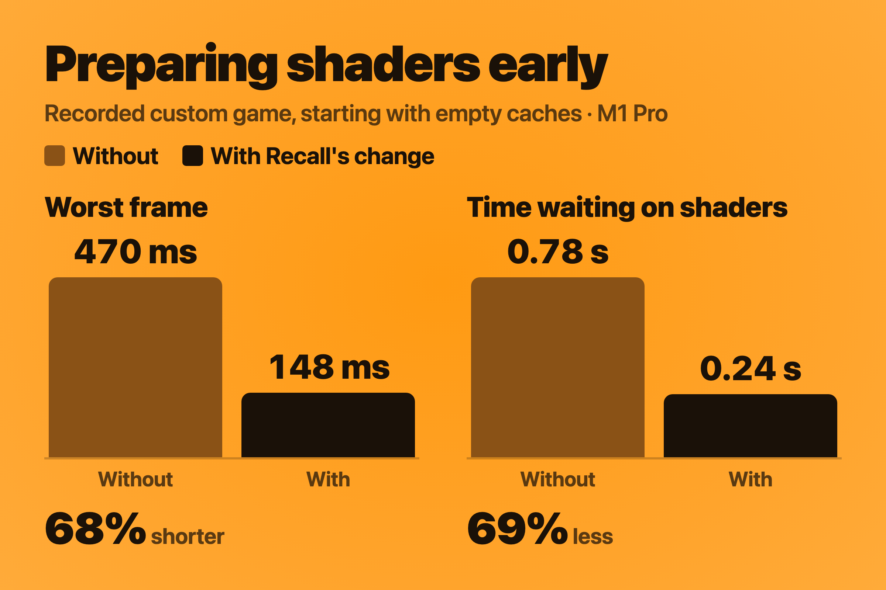
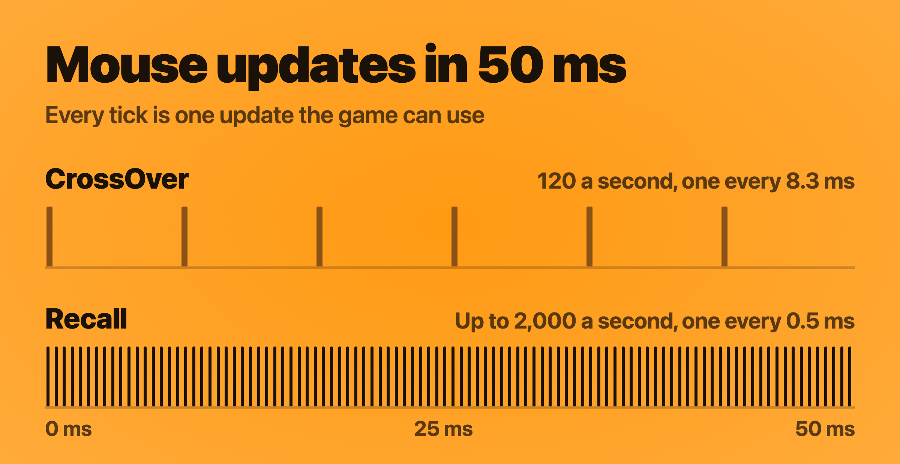

# How Recall runs faster

On the same MacBook Pro, in the same custom game, Recall averaged 70% more
frames per second than CrossOver, with 1% lows about five times higher, 95%
fewer stutters and up to 16 times more mouse updates. This page explains what
Recall does differently to get there. The full results are in the
[performance notes](PERFORMANCE.md).

## What's under the hood

Overwatch is a Windows game, so three translators sit between it and your Mac:

- **Wine** runs the Windows versions of Battle.net and Overwatch. Recall builds
  it from the source CodeWeavers publishes for CrossOver.
- **Rosetta** translates the game's Intel code for Apple Silicon.
- **DXMT** translates the game's graphics, written for DirectX 11, into Metal,
  the graphics system on every Mac.

  

CrossOver uses Wine and Rosetta too. For graphics, its default is D3DMetal, from
Apple's Game Porting Toolkit.

DXMT got Overwatch running on Metal, but my first matches with it stuttered a
lot, and the mouse wasn't right in fullscreen. Most of the work since went into
the changes on this page, made to DXMT and Wine for Overwatch.

| Result | What does most of the work |
|---|---|
| +70% average FPS | Keeping Apple's image compression on, a cheaper scaling step, a third frame buffer |
| 5× higher 1% lows | Waits that end on time, and frame pacing |
| 95% fewer stutters | Shaders prepared before they're needed, and Wine's freezes removed |
| Up to 16× more mouse updates | Reading the mouse directly |

**About the numbers below.** Each change was measured on my M1 Pro by testing
Recall with and without it. Recall's developer tools can replay a recorded match
off-screen, so both versions draw exactly the same frames. The CrossOver
comparison measures everything together, so this page doesn't split the 70%
into pieces.

## More frames per second

On this Mac, Overwatch is limited by the graphics chip (GPU), so the frame rate
comes down to how much GPU work each frame costs.

**Keeping Apple's image compression on.** Apple's GPUs compress the images a
game draws into, without losing any detail, so there's less data to move. A
game can mark an image as one that GPU programs may write to directly, and Metal
switches compression off for those. Overwatch marks 12 of its full-screen images
that way but never uses them like that. Recall keeps compression on until the
game actually writes to an image that way. In a recorded match, the same frames
took about 20% less GPU time, with identical pixels.

**A cheaper scaling step.** In fullscreen, the game draws at the resolution you
choose, and Recall scales it sharply to fit your screen. Rewriting that step
made it 41% cheaper: 0.63 ms per frame instead of 1.08 ms, when scaling
1920 × 1200 to a MacBook Pro's display.

**A third frame buffer.** With two buffers, Recall often had to wait for the
last frame to reach the screen before it could start on the next one. With
three, it keeps working.

## Higher 1% lows

1% lows are the frame rate during the slowest 1% of frames: the dips you feel
in a fight. They come from the heaviest scenes and from moments when the game
is kept waiting, so the sections either side of this one do most of the work
here: lighter frames lift the heavy ones, and fewer stalls lift the rest. Two
more changes deal with how each frame is timed.

**Waits that end on time.** Each frame, the game waits for the GPU to finish
earlier work. DXMT's way of waiting often woke up late. Recall's wakes up the
moment the work is done. The idle gap between frames fell from 0.42 ms to
0.12 ms.

**Frame pacing.** On their own, earlier wake-ups make frames start sooner and
then sit in a queue. So after each frame, Recall estimates how long the GPU
still needs, based on the last 96 frames, and lets the game wait for most of
that time before starting the next one. The frame rate stays the same, and
each frame uses more recent mouse input. The
time from the game starting a frame to the GPU finishing it fell by 16%. A
hitch resets the estimate, so a slow moment doesn't throw off the frames after
it.

## Fewer stutters

A stutter is a frame that takes longer than 50 ms: a visible hitch. Most come
from the GPU being asked to use a program it hasn't prepared yet. The rest come
from Wine pausing the game.

**Shaders prepared before they're needed.** Shaders are the small programs the
GPU runs to draw each scene, and each one has to be translated for Metal before
it can be used. Overwatch creates its shaders well before it draws with them,
so Recall translates them in the background as soon as they're created, rather
than in the middle of a fight. Shaders that would translate to the same thing
are translated once. Starting with empty caches, the time the game spent
waiting on shaders fell by 69%, and the worst frame went from 470 ms to 148 ms.

  

**Remembering what it learned.** Recall saves the graphics pipelines it builds.
Each time you launch, it prepares the most expensive ones it has seen before,
up to 128 in the first 10 seconds. This is why stutter fades the more you play.
When a burst of new shaders arrives, eight background workers translate them
instead of four.

**Wine's freezes removed.** Two problems in Wine itself paused the whole game:
- While loading a library, Wine held a lock that the game also needed, for
  170–770 ms each time under Rosetta. In matches, that meant a 150–400 ms freeze
  every 20 to 25 seconds. Recall now holds that lock for under 1 ms.
- Every 30 seconds, Wine stopped every program for about a tenth of a second
  while it saved its settings. Recall saves them from a copy of Wine's server,
  so the game keeps running.

**Clicks that don't cost a frame.** Every left click made macOS announce the
game as active again, and Wine responded by re-reading the list of displays:
about 16 ms on the game's main thread, 96 times in one match. Recall re-reads
it only when something has actually changed. In a 15-minute test session, no
re-reads happened during play.

## Mouse updates

CrossOver gets mouse movement from macOS pointer updates, 120 times a second.
Every time Overwatch snaps its hidden cursor back to the center of the screen,
a little of your movement is lost. Recall reads the mouse directly, up to 2,000
times a second depending on your mouse, the way native Mac games do, so none of
your movement is lost. The [mouse input notes](PERFORMANCE.md#mouse-input) have
the details. Trackpads keep working the usual way.

  

## The code

Every change on this page is open source. The [patches](../patches/README.md)
list what Recall changes in DXMT and Wine, and [building Recall](BUILDING.md)
explains how to build it yourself.

Recall stands on a lot of other people's work: Wine and CodeWeavers' published
CrossOver sources, DXMT by Feifan He through NerRobDog's fork, and Soju's
runtime build recipe.
