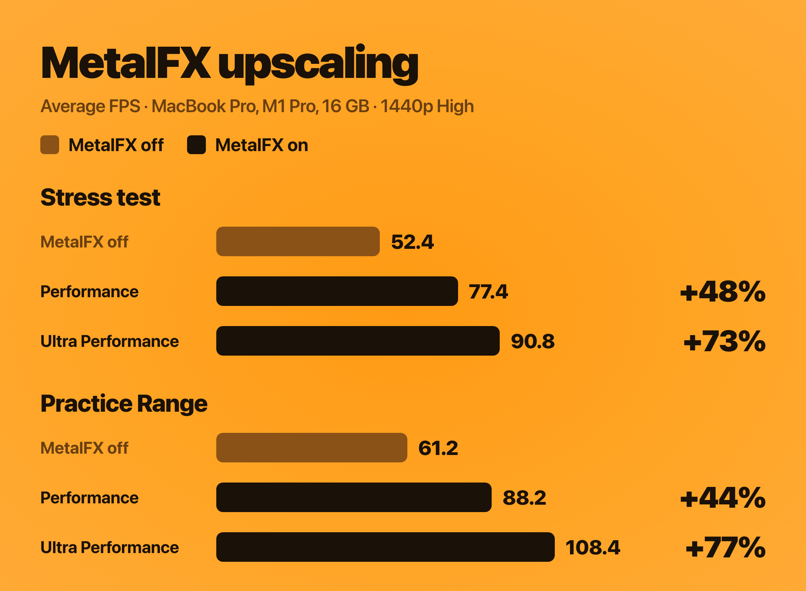
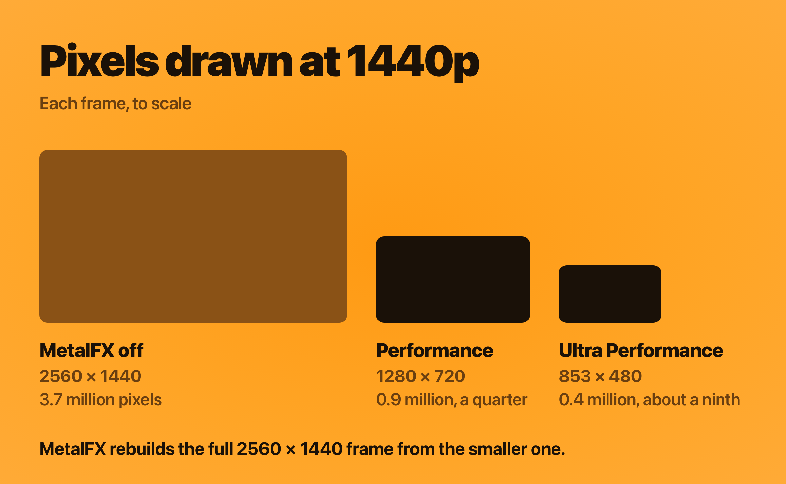
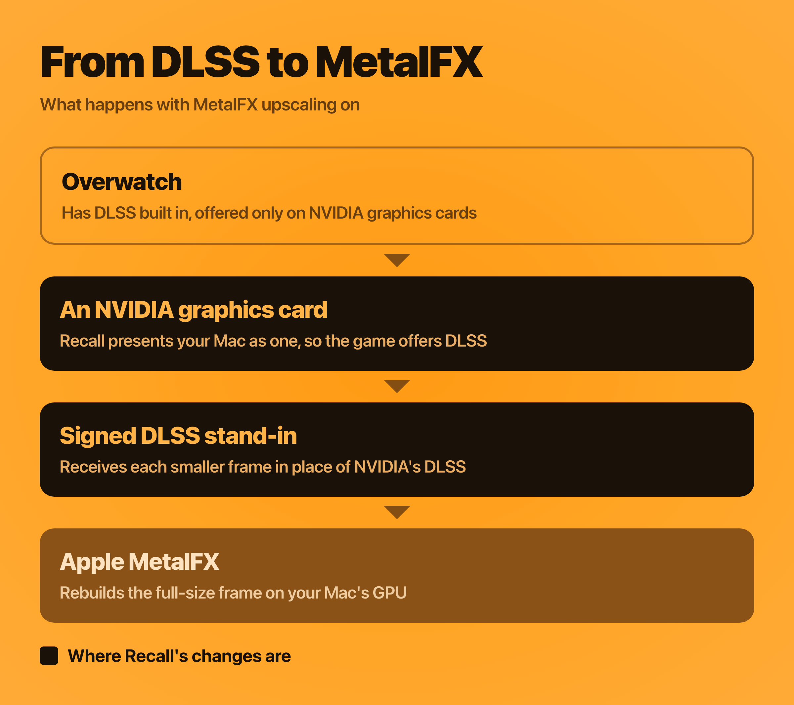

# MetalFX upscaling

https://github.com/user-attachments/assets/b3146f0f-a786-404c-b848-5db861738b50

MetalFX is Apple's upscaling technology, built into macOS. With MetalFX
upscaling turned on in Recall, Overwatch draws each frame at a lower resolution
and MetalFX rebuilds it at your screen's full resolution. You get more frames
per second without lowering your resolution or graphics settings.

On my 14-inch MacBook Pro (M1 Pro, 16 GB), at 2560 × 1440 on the High preset,
MetalFX raised the average frame rate by 44% to 77%, depending on the mode.

## Results

  

| Average FPS | MetalFX off | Performance | Ultra Performance |
|---|---:|---:|---:|
| **Stress test** | 52.4 | **77.4** (+48%) | **90.8** (+73%) |
| **Practice Range** | 61.2 | **88.2** (+44%) | **108.4** (+77%) |

14-inch MacBook Pro (M1 Pro, 16 GB). Overwatch fullscreen at 2560 × 1440, High preset, Dynamic Render Scale off. The stress test is custom game 929PJ by [u/Working_Dealer_5102](https://www.reddit.com/r/linux_gaming/comments/1u4oanq/auto_precompile_shaders_for_overwatch_for_peak/), which moves through each map using every hero's abilities. In the Practice Range I walked the range, turned the camera and shot bots.

## How upscaling works

Most of the work in a frame goes into working out the color of each pixel, and
at 2560 × 1440 there are about 3.7 million of them. Upscaling cuts that work by
drawing fewer pixels.

In Performance mode, Overwatch draws each frame at 1280 × 720, a quarter of the
pixels. In Ultra Performance, it draws 853 × 480, about a ninth. MetalFX then
builds the full 2560 × 1440 frame from that smaller one.

  

Stretching a small image on its own makes it blurry. MetalFX does better
because it doesn't work from one frame alone. Every frame, the game shifts its
view by a fraction of a pixel, so each frame catches slightly different detail.
The game also reports how everything on screen moved since the last frame.
MetalFX uses both to line up detail from earlier frames and fill in the
full-size picture. It's the same idea as DLSS and FSR on a PC.

## How Recall makes it work

Overwatch has this kind of upscaling built in, but only as NVIDIA DLSS, and it
only offers DLSS on NVIDIA graphics cards. Macs don't have NVIDIA graphics, so
the option never appears.

DXMT, the open-source project Recall uses to translate Overwatch's graphics to
Metal, includes a stand-in for NVIDIA's DLSS component that hands the work to
MetalFX instead. With MetalFX upscaling turned on, Recall does three things:

1. **It presents your Mac as an NVIDIA graphics card.** Overwatch sees an
   NVIDIA GeForce RTX 4090 and adds DLSS to its Video settings.
2. **It signs the stand-in.** Overwatch only loads a DLSS component that carries
   a valid digital signature, so Recall signs DXMT's stand-in with its own
   certificate.
3. **It hands each frame to MetalFX.** When you choose DLSS, Overwatch gives
   the stand-in its smaller frame, along with how far away and how fast
   everything on screen is moving, and asks for a full-size frame back. MetalFX
   does that work on your Mac's GPU. NVIDIA's DLSS isn't used at all.

  

## Choosing a mode

Performance and Ultra Performance give the biggest gains. Ultra Performance
draws the fewest pixels, so it's the fastest, with a softer picture.
Performance keeps more detail.

**Sharpening.** Settings › Graphics › Sharpening in Recall adds a sharpening
pass after MetalFX, at Low or High, for a crisper picture. It's off by default
and adds very little work.

## Turning it on

1. Close Battle.net if it's open. In Recall, turn on Settings › Graphics ›
   MetalFX upscaling.
2. Press Play.
3. In Overwatch, open Options › Video, choose NVIDIA DLSS, then choose a mode.

To turn it off, close Overwatch and Battle.net and turn the setting off.
Overwatch goes back to your Mac's own GPU and keeps your other video settings.

## Good to know

- While it's on, Overwatch lists your graphics card as an NVIDIA GeForce RTX
  4090. Your Mac's GPU does all the work.
- The NVIDIA Reflex option appears in the game's settings, but it has no effect.
- MetalFX upscaling doesn't change Overwatch's game files. Recall puts the DLSS
  stand-in in Wine's Windows folder, alongside its other graphics files.

## The code

The changes are in
[`dxmt-metalfx-upscaling.patch`](../patches/dxmt-metalfx-upscaling.patch), and
the [patch notes](../patches/README.md) describe each one. The DLSS stand-in
comes from DXMT by Feifan He, through NerRobDog's fork. Thanks to
[@jakubjenigar](https://github.com/jakubjenigar) for asking for MetalFX in
[issue #12](https://github.com/AsherJN/recall/issues/12).
